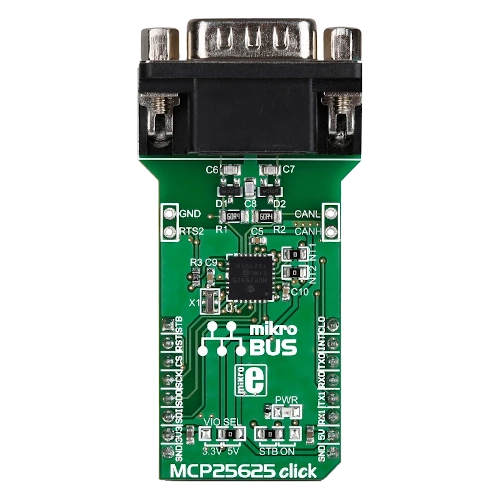

.. _mikroe_mcp25625_click_shield:

MikroElektronika MCP25625 Click shield
######################################

Overview
********

The MCP25625 Click shield has a `MCP25625`_ CAN controller via a SPI
interface with an integrated high-speed `MCP2562`_ CAN transceiver. This
CAN controller is software compatible with the stand-alone `MCP2515`_
CAN controller.

More information about the shield can be found at
`Mikroe MCP25625 click`_.

   MikroElektronika MCP25625 Click (Credit: MikroElektronika)

Requirements
************

The shield uses a mikroBUS interface. The target board must define the
``mikrobus_spi`` and ``mikrobus_header``  node labels (see :ref:`shields`
for more details). The target board must also support level triggered
interrupts and SPI clock frequency of up to 10 MHz.

Programming
***********

Set ``--shield mikroe_mcp25625_click`` when you invoke ``west build``,
for example:

.. zephyr-app-commands::
   :zephyr-app: samples/drivers/can/counter
   :board: lpcxpresso55s28
   :shield: mikroe_mcp25625_click
   :goals: build flash

References
**********

.. target-notes::

.. _MCP2515:
   https://www.microchip.com/en-us/product/MCP2515

.. _MCP2562:
   https://www.microchip.com/en-us/product/MCP2562

.. _MCP25625:
   https://www.microchip.com/en-us/product/MCP25625

.. _Mikroe MCP25625 click:
   https://www.mikroe.com/mcp25625-click
